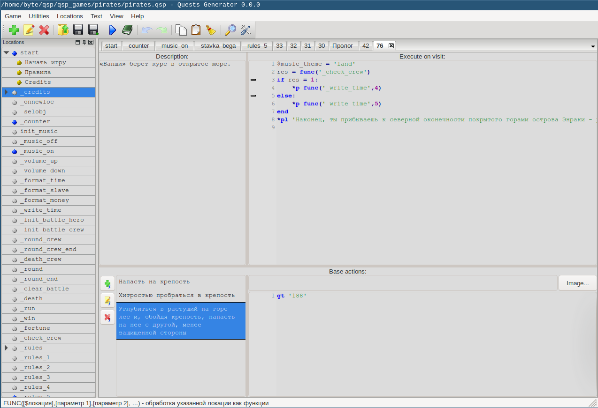
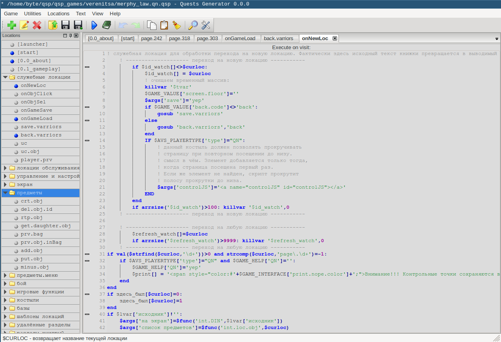

# QGen game editor

Please check [Releases](https://github.com/QSPFoundation/qgen/releases) section.

## Screenshots

 

## Linux & MacOS build

```bash
cmake -S . -B build -DCMAKE_BUILD_TYPE=Release
cmake --build build
```

## Windows build

```bash
cmake -S . -B build -G "Visual Studio 17 2022" -A Win32 -DCMAKE_INSTALL_PREFIX=out
cmake --build build --target install --config Release
```

## TODO

* Improve "Search & Replace" functionality
* Add filtering for shown locations
* Build web editor

## Support us

Please consider supporting our development on:
* Buy me a coffee: https://buymeacoffee.com/varg
* Ethereum/EVM: 0x4537B99e27deD6C8459C1eFCdE0E7fa48357e44D
* PayPal: [](https://www.paypal.com/donate/?hosted_button_id=RB8B6EQW4FW6N)

## Chat group

https://discord.gg/6gWVYUtUGZ
